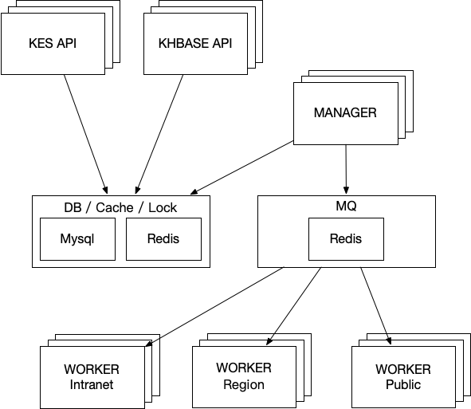

# OASIS 2

## What is OASIS 2

OASIS 2 a simple, stable, efficient Big Data Hosted Platform that was refactored from OASIS.

## Features

- Compatible
    - Compatible with almost every product and situations.
- Light weighted
    - Easy to coding, deploy, operate and maintain.
    - Less third party dependencies.
- Scalable
    - All components are scalable, and they can deploy on either single host or individual hosts.
    - Web servers can divide by product line, prefix or action, or all api can be combined in one server.
    - Workers can focus on specific works, depending on the topics.
- Job Management
    - Flexible job arrangement.
    - High concurrency.
    - Easy to trace job results.

## Architecture

## Documentation

- API DOC
  http://newgit.op.ksyun.com/cloud-bigdata/k-products-conventions

## Releases

### v0.0.2 开发中

- KES上线
- Sahara迁移
- 任务回滚

### v0.0.1

- Oasis代码重构
- KHbase上线
  